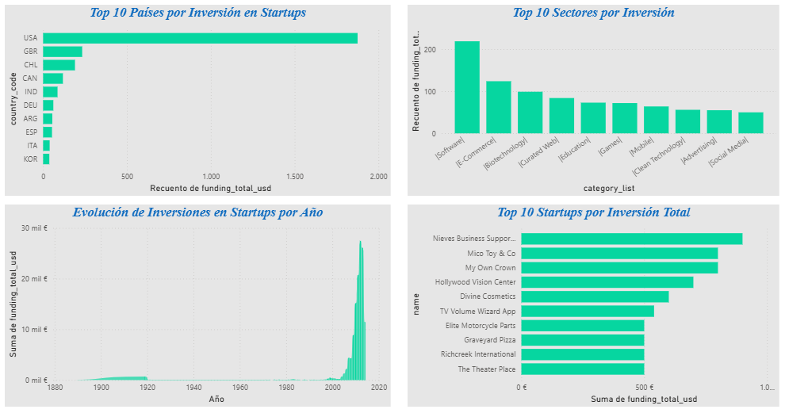

# 🚀 Proyecto 01 — Ecosistema Global de Startups


```

## 📌 Descripción
Análisis del ecosistema mundial de startups usando datos reales de Crunchbase.
El dashboard responde preguntas clave sobre inversión, geografía y tendencias históricas.

## ❓ Preguntas que responde este análisis
- ¿Qué países concentran más inversión en startups?
- ¿En qué sectores se invierte más dinero?
- ¿Cómo ha evolucionado la inversión a lo largo del tiempo?
- ¿Qué startups han recibido más financiamiento?

## 💡 Insights principales

**1. USA domina de forma aplastante**
USA invierte el triple que Reino Unido, el segundo país en el ranking. La concentración de capital en un solo país es brutal — lo que sugiere que el ecosistema startup global todavía depende enormemente del mercado norteamericano.

**2. Software lidera porque resuelve problemas reales**
El sector ganador fue Software, y tiene sentido: los sistemas se crean para solucionar necesidades concretas de las empresas. Esto abre una pregunta interesante para un análisis futuro — ¿en qué industrias específicas se está desarrollando más software para automatizar y mejorar procesos?

**3. El boom llegó en 2012**
A partir del año 2012 la inversión explota, superando los 20 mil millones. Esto coincide con la masificación del smartphone y el auge de aplicaciones móviles que transformaron industrias enteras.

**4. USA apuesta por todos los sectores**
Lo más sorprendente no es solo cuánto invierte USA, sino que lo hace en todos los sectores del ranking. No hay un nicho específico — hay una apuesta transversal por la innovación que le da una ventaja competitiva enorme frente al resto del mundo.

## 🛠️ Herramientas utilizadas
- **Power BI Desktop** — visualización y dashboard
- **Power Query** — limpieza y transformación de datos
- **Excel** — exploración inicial del dataset

## 🧹 Proceso de limpieza de datos
- Conversión de columna `funding_total_usd` de texto a número decimal
- Eliminación de filas con valores nulos en `country_code` y `category_list`
- Limpieza de caracteres especiales (`|`) en la columna `category_list`
- Eliminación de columnas irrelevantes (`permalink`, `homepage_url`)

## 📊 Visualizaciones
| Gráfico | Descripción |
|---|---|
| Top 10 Países | Países con mayor inversión total en startups |
| Top 10 Sectores | Industrias con más financiamiento |
| Evolución Anual | Tendencia histórica de inversión 1900-2015 |
| Top 10 Startups | Empresas con mayor inversión recibida |

## 📁 Archivos
- `startup-ecosystem-dashboard.pbix` — Dashboard en Power BI
- `investments_VC.csv` — Dataset original (Crunchbase via Kaggle)

## 🔗 Fuente de datos
[Crunchbase Startup Investments — Kaggle](https://www.kaggle.com/datasets/arindam235/startup-investments-crunchbase)

---
*Proyecto desarrollado como parte de mi portafolio de análisis de datos | Angelina Faggioni — Ecuador 🇪🇨*
